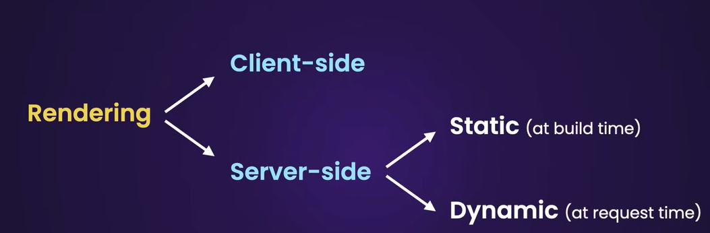

# Next.js
Create the app in the directory :
```sh
npx create-next-app@latest
```

Start the app on public host (to make sure it is accessible from any local machine):
```sh
npx next dev -H 0.0.0.0 -p 3000
```

Then, the app is running on ```http://YourLocalIp:3000/```

## Telemetry
By default Next.js collects completely anonymous [telemetry](https://nextjs.org/telemetry) data about general usage.

It is possible to disable telemetry :
```sh
npx next telemetry disable
```

To check if it is enabled or not :
```sh
npx next telemetry status
```

You can view exactly what is being collected by setting the following environment variable: ```NEXT_TELEMETRY_DEBUG=1```. You may also opt-out by setting an environment variable: ```NEXT_TELEMETRY_DISABLED=1```.


## Routing
[Routing conventions](https://nextjs.org/docs/getting-started/project-structure#routing-files)

<br/>


---
- SSR == Server-side rendering
- CSR == Client-side rendering


## Styling

To style the app, I think [TailwindCSS](https://tailwindcss.com/) is the best choice as  it is very popular and it is already baked into most WEB App Framework, even if it get some mixed love and hate opinions. I don't think [Bootstrap](https://getbootstrap.com/) is relevant for a new long term project as it has failed to maintain its community even if it is evolving in the right way.
<br/> 
<br/> 
|  |
|:--:| 
|  ***bootstrap** vs **tailwindcss**, [npm downloads](https://npmtrends.com/bootstrap-vs-tailwindcss) in past 5 years*  |  
<br/>  

To avoid stacking 50 class in every HTML tag and have a more uniform look with ease of use; using components library is advised. It allow to quickly make basic components (like already included in [Bootstrap](https://getbootstrap.com/) if you are familiar with it. e.g. button style, checkbox style, dropdown style ...).  

While [TailwindCSS](https://tailwindcss.com/) have it's own [TailwindCSS UI](https://tailwindui.com/) library, you need a paid subscription to access most of them, so here is some popular ones (not all 100% free too):
  
- [Daisy UI](https://daisyui.com/components/) : Reusable component made with tailwind (I like the easy theme switch), *32k stars on [GitHub](https://github.com/saadeghi/daisyui)*
- [Material UI](https://mui.com/material-ui/) : Alternative to Daisy UI (components that use Google's Material Design, so non-Tailwind related), *93k stars on [GitHub](https://github.com/mui/material-ui)*
- [Mantine](https://mantine.dev/) : An other alternative to UI component, *25k stars on [GitHub](https://github.com/mantinedev/mantine)*

<br/>

> "[...] with MUI you sacrifice ease of use for flexibility, so it may be very well suited to large teams, but as a solo developer I didn't enjoy it. [...] With Mantine, things just do what they do. I like it because it provides a really large amount of useful components and hooks, but it doesn't feel like it forces you into an ecosystem."  
>
>Here's a [Reddit thread link](https://www.reddit.com/r/reactjs/comments/17jbvyc/comment/k70k7qg/?utm_source=share&utm_medium=web3x&utm_name=web3xcss&utm_term=1&utm_content=share_button) talking about Mantine vs Material UI developer experience.

## Internationalization
There si some recommandation in the [Next.js Documentation](https://nextjs.org/docs/app/building-your-application/routing/internationalization) about internationalization, especially routing.  
Given our context I think using [next-intl](https://next-intl-docs.vercel.app/) is a good choice.

It is possible can be used to handle i18n routing with path like ```/en/about``` or domain-based routing like ```en.example.com/about``` or without i18n routing if you use single or base language on user setting instead.

Localize your messages with interpolation, cardinal & ordinal plurals, enum-based label selection and rich text.
Here is an exemple of ICU message syntax :

```json
{  
    "UserProfile": {
            "title": "{firstName}'s profile",
                "followers": "{count, plural, 
                                =0 {No followers yet} 
                                =1 {One follower} 
                                other {# followers} 
                               }"
    }
}
```

next-intl also handle lists with conjunction, disjunction etc.  

see the [next-intl Documentation](https://next-intl-docs.vercel.app/docs/getting-started/app-router/without-i18n-routing)

## Testing
TODO