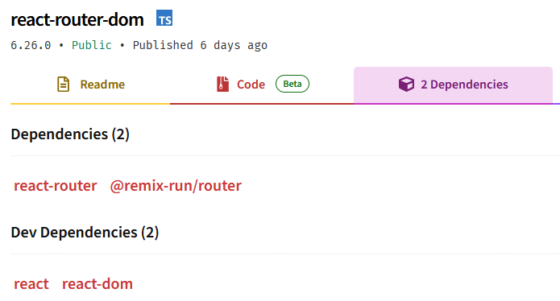

# Remix.run

Remix was created during the COVID-19 pandemic and then has been acquired by [Shopify](https://www.shopify.com/). It was created by the same team that made the popular [React router](https://reactrouter.com/en/main) aiming to offer more features.

> "[...] Remix is built on top of React Router and maintained by the same team. This means that you can use all the features of React Router in your Remix app.
>
>This also means that the 90% of Remix is really just React Router: a very old, very stable library that is perhaps the largest dependency in the React ecosystem. Remix simply adds a server behind it. [...]"
>
> Source : [Remix.run documentation](https://remix.run/docs/en/main/discussion/react-router)

>"The @remix-run/router package is a framework-agnostic routing package (sometimes referred to as a browser-emulator) that serves as the heart of [React Router](https://reactrouter.com/) and [Remix](https://remix.run/) and provides all the core functionality for routing coupled with data loading and data mutations. [...] This router is a low-level package intended to be consumed by UI layer routing libraries. You should very likely not be using this package directly unless you are authoring a routing library such as react-router-dom or one of it's other UI ports."
>
> Source : [npm](https://www.npmjs.com/package/@remix-run/router)

However [Remix](https://remix.run/) never reached the popularity their original [React router](https://reactrouter.com/en/main) still has. This is probably due to other option that have already filled the gap since then (e.g. [Next.js](https://nextjs.org/), [TanStack](https://tanstack.com/), [SvelteKit](https://kit.svelte.dev/), etc.)

After an announcement at React CONF 2024, Remix should no longer be used as it was completely merged to React router, React Router v7 should be used instead and it includes all the Remix.run features.

> "So we're remixing React Router (again).
>
> Actually, we're doing a little more than that. Remix has always just been a layer on top of React Router - and that layer has been shrinking over time. It's now so small that we're just going to eliminate it. What we planned to release as **Remix v3** is now going to be released as **React Router v7**."  
>
> Source : [Remix.run blog post](https://remix.run/blog/merging-remix-and-react-router)

Historically, you had to do major rework to upgrade from React router V4 to V5 and V5 to V6, hopefully this will standardize React Router so we don't have to run into this issue again.

In the same blog post the Remix team stated that if you are already using Remix.run you could just continue using it as they will "provide a codemod to automatically update all of your imports" when React router V7 comes out.